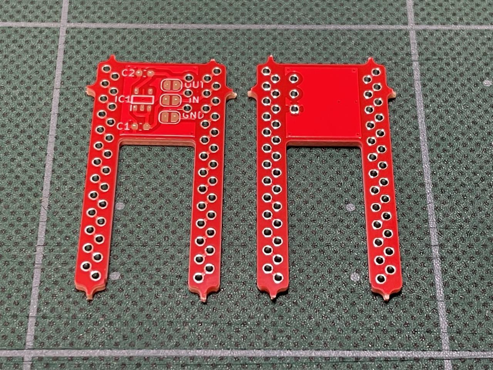

#  pin2conthroughとは

Pro MicroやBLE Micro Proなどをブレッドボードでテストする際に、[マックエイト社のコンスルー](https://www.mac8sdk.co.jp/products/217)を使えるようにする変換基板です。自作キーボードなどで用いるマイコンボードにピンヘッダを取り付けずに利用できます。

変換基板は2列x13ピン構成でとなっています。マイコンボード用のスルーホール列の間隔は15.24mm(2.54x6)です。ブレッドボード用のスルーホール列は内側にあり、ブレッドボードが有効に使えます。スルーホール径は0.85mm(設計値)です。ピンヘッダは[秋月電子の細ピンヘッダ](https://akizukidenshi.com/catalog/g/gC-04397/)を使用します。また、[SOT-23-5タイプのレギュレータ](https://akizukidenshi.com/catalog/g/gI-10675/)を実装できるようになっています。ハンダジャンパによって26ピンに出力が可能です。入力は24と25からGNDとVCCを利用します。例えばBLE Micro Proの場合、このピンにコンスルーを使わないことで、ブレッドボードで3.3Vや1.8Vを電源として用意できます。レギュレータとコンデンサは付いていませんので、別途ご用意ください。

面付した基板で製造しているため、バリが残っています。使用の際はダイヤモンドやすりなどで整形したうえでご使用ください。ダイヤモンドやすりは100均ショップのもので十分です。
